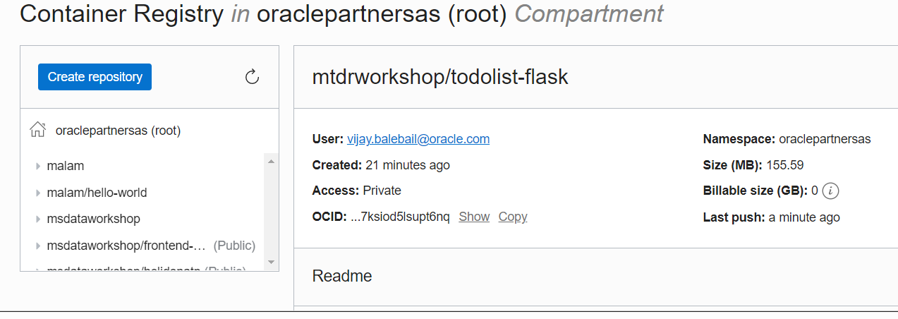
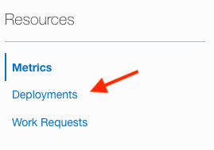
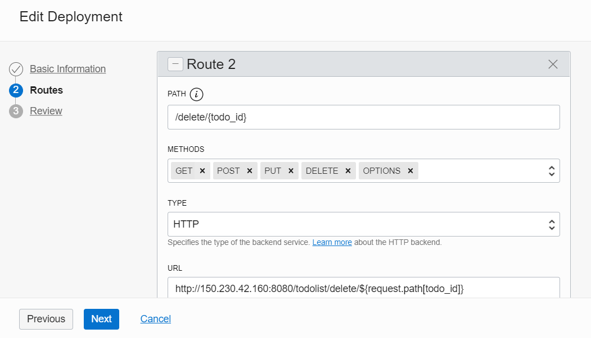
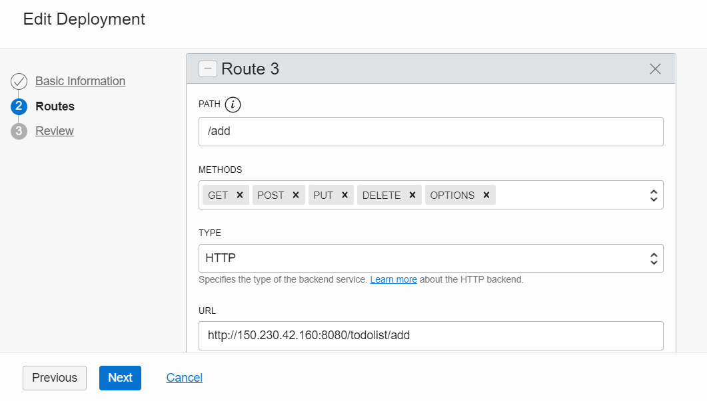
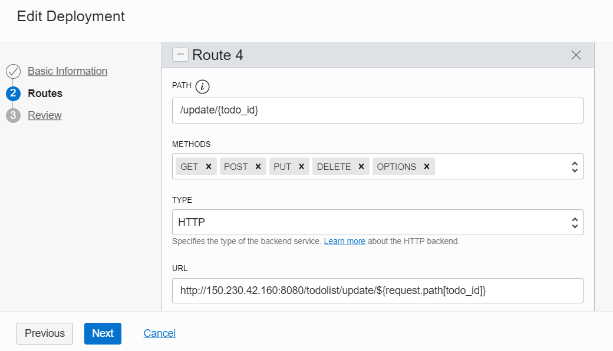
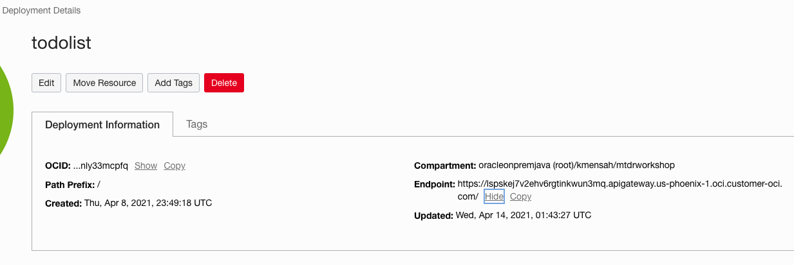

# Backend

## Introduction

In this lab,
- You will build a Python/Flask Docker image.
- you will deploy the Docker image to OKE.
- then configure the API Gateway.

Estimated time: ~45 minutes.

### Understanding the Python/backend application

As with most React applications (https://reactjs.org/), this application uses remote APIs to handle data persistence. The backend implements 5 REST APIs including:
- Retrieving the current list of todo items
- Adding a new todo item
- Updating an existing todo items
- Deleting a todo item.


### Objectives

* Set values for environment variables
* Build and deploy the Docker image of the application
* Deploy the image on the Oracle Kubernetes Engine (OKE)
* Describe the steps for Undeploying
* Configure the API Gateway
* Test the backend application

### Prerequisites

- This lab requires the completion of lab 1 and the provision of the OCI components.


## Task 1: Set values for workshop environment variables

1. Set the root directory of the workshop

	```
	<copy>export MTDRWORKSHOP_LOCATION=~/mtdrworkshop</copy>
	```
2. Run source addAndSourcePropertiesInBashrc.sh

	The following command will set the values of environment variables in mtdrworkshop.properties and source ~/.bashrc

	```
	<copy>cd $MTDRWORKSHOP_LOCATION; source addAndSourcePropertiesInBashrc.sh</copy>
	```

## Task 2: Build and push the Docker images to the OCI Registry

1. Ensure that the "DOCKER_REGISTRY" variable is set

 Example: `<region-key>.ocir.io/<object-storage-namespace>/<firstname.lastname>/<repo-name>`
 If the variable is not set or is an empty string, the push will fail (but the docker image will be built).

2. copy the Python/Flask Todo app from github.

     ```
     <copy>
      mkdir ~/mtdrworkshop/python
      cd ~/mtdrworkshop/python
      git clone https://github.com/vijaybalebail/Todo-List-Dockerized-Flask-WebApp.git
      cd Todo-List-Dockerized-Flask-WebApp
      </copy>
  	 ```

3. Unzip the database wallte.zip file within the new web app.
     ```
     <copy>
     unzip ~/mtdrworkshop/setup-dev-environment/wallet.zip
     </copy>
  	 ```

3.  Pick mtdrb_tp service alias (see the list of aliases in
   ./tnsnames.ora)

   

4. There are many ways to pass database credentials from the backend to Oracle database. We are using a config file.
   Edit the config.cfg file and edit the username,password and connect string. This user and password  is the one created during lab_setup.

     ```
     <copy>
     ADB_USER="TODOUSER"
     ADB_PASSWORD="Saturday_123"
     ADB_TNSNAMEs="mtdrdb_tp"
     </copy>
     ```

5. Edit the sqlnet.ora and change the docker virtual wallet directory to "/app"

  ```
	<copy>
	WALLET_LOCATION = (SOURCE = (METHOD = file) (METHOD_DATA = (DIRECTORY="/app")))
  SSL_SERVER_DN_MATCH=yes
	</copy>
	```
6. We now can build the a docker image with Python, Oracle Client , and the todo application app.js.
   Look at the construct of the Dockerfile and execute the command to build the docker image.

    ```
    <copy> docker build  -t todolist-flask:latest . </copy>

     (us-ashburn-1)$ docker build  -t todolist-flask:latest .
    Sending build context to Docker daemon  1.297MB
    Step 1/15 : FROM oraclelinux:7-slim
    Trying to pull repository docker.io/library/oraclelinux ...
    7-slim: Pulling from docker.io/library/oraclelinux
    7627bfb99533: Pull complete


    Step 15/15 : CMD python3 app.py
     ---> Running in 94ef1e230b45
    Removing intermediate container 94ef1e230b45
     ---> 02f268c26542
    Successfully built 02f268c26542
    Successfully tagged todolist-flask:latest
    ```

    Verify that the images are CREATED.
    ```
    $ <copy>
    docker images</copy>
    REPOSITORY          TAG                 IMAGE ID            CREATED             SIZE
    todolist-flask      latest              02f268c26542        34 seconds ago      477MB
    oraclelinux         7-slim              0a28ba78f4c9        2 months ago        132MB

    ```
## Task 3: Run Docker image locally and verify.
   We created our image using the command docker build. Now that we have an image, we can run that image and see if our application is running correctly. Since we are running a application that listens on a port, we will have to run this in Detach or background mode.

  1. Run image locally and verify the image is running.

     ```
     <copy>
     docker run -d  -p 5003:5000  todolist-flask:latest
     docker ps
     </copy>
      $    docker ps
      CONTAINER ID        IMAGE                   COMMAND                       PORTS                    NAMES
      b167d3a24057        todolist-flask:latest   "/bin/sh -c 'python3…"    0.0.0.0:5003->5000/tcp   relaxed_shirley

     ```

  2. Run curl get script to verify you can access data locally.
     ```
     <copy>
       curl -GET http://0.0.0.0:5003/todolist/foo
     </copy>
     ```

## Task 4: Tag & push image to the registry.

   1. Now that you have a docker image running locally, you are now ready to run it from OKE cluster.
   Give a tag to the image that you're going to push to Oracle Cloud Infrastructure Registry by entering:
     ```
     <copy>
     docker tag todolist-flask:latest $DOCKER_REGISTRY/todolist-flask:latest
     docker push $DOCKER_REGISTRY/todolist-flask:latest
     </copy>
     ```

  In a couple of minutes, you should have successfully built and pushed the images into the OCIR repository.

  2.  Check your container registry from the **root compartment**
    - Go to the Console, click the hamburger menu in the top-left corner and open
    **Developer Services > Container Registry**.

   

3. Mark Access as Public  (if Private)  
   (**Actions** > **Change to Public**):

   


## Task 5: Deploy on Kubernetes and Check the Status

1. Verify the todo.yaml file.
   Ensure you have the image name in oracle docker registory, the name of the imagePullSecret that was created in step 5 of lab1.

	```
	<copy>cd ~/mtdrworkshop/python/Todo-List-Dockerized-Flask-WebApp;
	      cp todo_template.yaml todo.yaml
        sed -i "s|%DOCKER_REGISTRY%|${DOCKER_REGISTRY}|g" todo.yaml
        kubectl create -f todo.yaml
  </copy>
	```

2. Check the status using the following commands. Verify the status is running for pods and you have a external-ip for LoadBalancer. You may have to rerun the command as it could take a couple of minutes to allocate a ip-address.
    ```
     $ <copy>
      kubectl get all </copy>
     $ kubectl get all
    NAME                                      READY   STATUS             RESTARTS   AGE
    pod/todo-deployment-657895dd59-qd89j      1/1     Running            0          3m1s

    NAME                   TYPE           CLUSTER-IP    EXTERNAL-IP      PORT(S)          AGE
    service/kubernetes     ClusterIP      10.96.0.1     <none>           443/TCP          32h
    service/todo-service   LoadBalancer   10.96.77.65   132.226.36.134   8080:31093/TCP   3m1s

    NAME                                 READY   UP-TO-DATE   AVAILABLE   AGE
    deployment.apps/todo-deployment      1/1     1            1           3m2s

    NAME                                            DESIRED   CURRENT   READY   AGE
    replicaset.apps/todo-deployment-657895dd59      1         1         1       3m2s

    ```


	The following command returns the Kubernetes service of ToDo application with a load balancer exposed through an external API
	```
	<copy>kubectl get services</copy>
	```

	

3. $ kubectl get pods
	```
	<copy>kubectl get pods</copy>
	```

	

4. Continuously tailing the log of one of the pods

  $ kubectl logs -f <pod name>
  Example kubectl logs -f todo-deployment-657895dd59-qd89j

5. For debugging deployment issues, you can run describe command and look at the errors at the end.

    kubectl describe pod <pod name>
    Example kubectl describe pod todo-deployment-657895dd59-qd89j

6. Now that your application has a external ipaddress, you can now access it both through curl and any web browser.
    ```
    curl -X GET http:<external_ipaddress>:8080/todolist
    or
    open a browser to the link http:<external_ipaddress:8080/todolist.
    ```


## Task 6: Configure the API Gateway

A common requirement is to build an API with the HTTP or HTTPS URL of a back-end service, We can provide a  front-end HTTPS access to the back-end URL using API Gateway..

The API Gateway protects any RESTful service running on Container Engine for Kubernetes, Compute, or other endpoints through policy enforcement, metrics and logging.
Rather than exposing the Todo App directly, we will use the API Gateway to define cross-origin resource sharing (CORS).

1. From the hamburger  menu navigate **Developer Services** > **API Management > Create Gateway**
   

2. Configure the basic info: name, compartment, VCN and Subnet
    - VCN: pick on of the vitual circuit network
    - Subnet pick the public subnet (svclbsubnet)

	The click "Create".
  	

3. Click on Todolist gateway
    

4. Click on Deployments
   

5. Create a todolist deployment
   

6. Configure the routes: we will define two routes:
    - /tododo for the first two APIs: GET, POST and OPTIONS
    

    - add  /todolist/delete route API: (GET, PUT and DELETE)
	   

     - add  /todolist/add route APIs.
 	   

     - add  /todolist/update route API.
      


## Task 7: Testing the backend application through the API Gateway

1. Navigate to the newly create Gateway Deployment Detail an copy the endpoint
   

2. Testing through the API Gateway endpoint
  postfix the gateway endpoint with "/todolist/todos" as shown in the image below


  It should display the Todo Item(s) in the TodoItem table. At least the row you have created in Lab 1.


## Acknowledgements

* **Author** -  - Kuassi Mensah, Dir. Product Management, Java Database Access
* **Contributors** - Jean de Lavarene, Sr. Director of Development, JDBC/UCP
* **Last Updated By/Date** - Anoosha Pilli, Database Product Management,  April 2021
